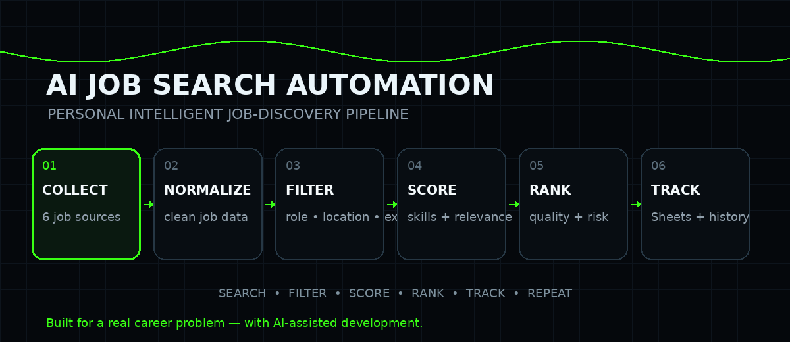

<div align="center">

# ⚡ AI JOB SEARCH AUTOMATION

### 🧠 A Personal Intelligent Job-Discovery System

**Search less. Filter smarter. Find better opportunities. 🚀**



<br/>

[](https://www.python.org/)
[](#-architecture)
[](#-automation)
[](#-tracking)
[](#-why-i-built-this)

</div>

---

## 💡 Why I Built This

Job hunting is one of those things that looks simple until you do it every day.

Open a portal.  
Search the same roles.  
Change the location.  
Read the experience requirement.  
Check the skills.  
Remove duplicate listings.  
Remember which jobs you've already seen.  
Repeat it all again tomorrow.

**I didn't want to keep doing the repetitive part manually.**

So I treated my own job search like an engineering problem.

As a Data Analytics / Data Science learner, I built a personal automation system that brings together multiple job sources, processes hundreds of listings, evaluates relevance, ranks opportunities, and tracks what has already been seen.

And I built it with a very deliberate philosophy:

> ### 🤝 **Let automation handle the repetitive work. Keep important decisions human.**

This isn't a tool I built because I wanted another portfolio project.

**I built it because I actually needed it.**

---

# 🎯 The Mission

<div align="center">

### **Turn hundreds of noisy job listings into a small, useful shortlist.**

</div>

The system is optimized around my current career stage and preferences:

| 🎯 Area | Current Focus |
|---|---|
| Primary roles | Data Analyst • Data Analyst Intern • Junior Data Analyst |
| Additional roles | Data Analytics Intern • Data Science Intern |
| Secondary roles | BI Analyst • Reporting Analyst • MIS Analyst • Analytics Associate |
| Experience | Fresher / Entry-Level / ~0–1 year |
| Locations | Delhi • Noida • Gurgaon / Gurugram • Remote |
| Priority skills | SQL • Excel • Power BI • Python • Pandas • EDA |
| Freshness | Prefer recent opportunities |
| Final action | Human review before applying |

---

# 🚀 What It Actually Does

```text
🌐 MULTIPLE JOB SOURCES
          ↓
📥 COLLECT RAW LISTINGS
          ↓
🧹 NORMALIZE & TRANSFORM
          ↓
🔎 EXTRACT SKILLS / EXPERIENCE / ELIGIBILITY
          ↓
🎯 FILTER ROLE + LOCATION + EXPERIENCE + FRESHNESS
          ↓
♻️ DETECT DUPLICATES & POSSIBLE REPOSTS
          ↓
📊 CALCULATE MATCH SCORE
          ↓
🛡️ ASSESS QUALITY + RISK
          ↓
🏆 RANK RESULTS
          ↓
📋 TRACK NEW JOBS IN GOOGLE SHEETS
          ↓
👤 HUMAN DECISION
```

---

# 🌐 Multi-Source Job Collection

The collector layer currently supports:

| Source | Role |
|---|---|
| 🔵 Adzuna | Job discovery |
| 🟠 Jooble | Job discovery |
| 🟣 The Muse | Job discovery |
| 🌎 Himalayas | Remote-focused discovery |
| 🌎 Jobicy | Remote-focused discovery |
| 🌎 Remotive | Remote-focused discovery |

The point isn't simply to collect **more** jobs.

The point is to avoid depending on one source and create a broader search surface before the filtering pipeline removes noise.

---

# 🧠 The Intelligence Pipeline

## 01 — 📥 Collection

Each source returns job listings in its own structure.

The collector layer brings those listings into one pipeline.

## 02 — 🧹 Transformation

Different APIs use different field names and formats.

The transformation layer standardizes:

- Company
- Role
- Location
- Work mode
- Salary
- Description
- URL
- Posted date
- Experience
- Eligibility
- Skills
- Job ID

## 03 — 🔎 Description Parsing

The parser extracts signals from job descriptions.

### Skills include:

`SQL` • `Microsoft Excel` • `Power BI` • `Python` • `Pandas` • `NumPy` • `Data Cleaning` • `EDA` • `Statistical Analysis` • `Data Visualization` • `Feature Engineering` • `MySQL` • `Machine Learning` • `Scikit-learn` • `XGBoost` • `Git` • `GitHub` • `Matplotlib` • `Seaborn` • `Plotly`

## 04 — 🎯 Eligibility

The system evaluates:

- 📍 Location
- 💼 Role relevance
- 🧑‍💻 Experience compatibility
- 🕐 Freshness

## 05 — ♻️ Deduplication

The system checks:

- Same source + job ID
- Same job URL
- Identical descriptions
- Same company + role + similar description
- Same company + role + location + description similarity

## 06 — 📊 Matching

Relevant skills, role relevance, experience, location, and supporting signals contribute to the match score.

## 07 — 🏆 Decision & Ranking

The strongest opportunities rise to the top.

---

# 📈 Match Scoring Philosophy

I intentionally avoided building an extremely hard filter.

Why?

Because real job descriptions are messy.

A good Data Analyst opening may:

- omit some skills,
- leave experience unknown,
- use different terminology,
- have an incomplete description,
- or appear slightly different across sources.

So the system follows:

> ### **Filter what is clearly incompatible. Score what is potentially relevant.**

That gives the pipeline a better balance between **precision and recall**.

---

# 🏷️ Decision System

| Decision | Meaning |
|---|---|
| 🟢 `APPLY` | Very strong match worth prioritizing |
| 🟢 `STRONG MATCH` | Highly relevant opportunity |
| 🟡 `REVIEW` | Relevant, but manually verify |
| 🟡 `CONSIDER` | Potentially useful |
| ⚪ `SKIP` | Low relevance for the current profile |
| 🔴 `DO NOT APPLY` | High risk or strong incompatibility |

### Important

This system **does not blindly apply to jobs**.

It helps me discover, evaluate, prioritize, and track opportunities.

**The final application decision remains mine.**

---

# 🛡️ Quality & Risk Layer

A job title alone doesn't tell the whole story.

The pipeline also considers job quality and potential scam risk.

This gives the final output another layer of context:

```text
MATCH SCORE
     +
QUALITY
     +
RISK
     =
BETTER DECISION
```

---

# 📋 Google Sheets Tracking

Relevant new opportunities can be stored in a personal Google Sheet.

Typical fields include:

`Date` • `Source` • `Company` • `Role` • `Location` • `Work Mode` • `Experience` • `Skills` • `Score` • `Risk` • `Quality` • `Decision` • `Job URL`

This turns the search process into a lightweight personal job-search database.

---

# 🧠 Job History

The system keeps a local history of previously seen job URLs.

That means:

```text
Seen before?
   │
   ├── YES → already seen
   │
   └── NO  → new opportunity
```

This is especially useful when multiple sources surface the same listing.

🔒 Personal history remains outside the public repository.

---

# ⏰ Automation

The system can be scheduled with **Windows Task Scheduler**.

My personal workflow is configured around:

**🕗 Start: ~8:00 AM**

**🔁 Repeat: every hour**

So instead of manually opening the project again and again:

```text
8:00 AM
   ↓
SEARCH
   ↓
FILTER
   ↓
SCORE
   ↓
TRACK

9:00 AM
   ↓
SEARCH AGAIN

10:00 AM
   ↓
SEARCH AGAIN

...
```

The machine handles the repetitive search cycle while I focus on learning, projects, applications, and interview preparation.

---

# 📊 Example Output

A real run can start with hundreds of raw listings and reduce them dramatically.

Example:

```text
RAW JOBS:            800+
LOCATION REJECTED:   290+
ROLE REJECTED:       340+
OLD JOBS:            100+
```

And then surface something like:

```text
🏆 ICG Medical | Data Analyst
📍 Noida
🧑‍💻 Experience: 1 year
🛠️ Skills: SQL, Power BI, Python, Reporting, Dashboarding

📊 Score: 86
🛡️ Risk: LOW
⭐ Quality: HIGH
🎯 Decision: STRONG MATCH
```

The objective isn't:

> **"Show me as many jobs as possible."**

The objective is:

> **"Show me the opportunities most worth my attention."**

---

# 🏗️ Architecture

```text
AI-Job-Search-Automation/
│
├── config/
│   └── profile.yaml
│
├── src/
│   ├── collectors/
│   │   ├── adzuna.py
│   │   ├── the_muse.py
│   │   ├── jooble.py
│   │   ├── himalayas.py
│   │   ├── jobicy.py
│   │   ├── remotive.py
│   │   └── multi_source.py
│   │
│   ├── processing/
│   │   ├── batch_processor.py
│   │   ├── transform.py
│   │   ├── job_parser.py
│   │   ├── freshness.py
│   │   ├── deduplication.py
│   │   ├── location_eligibility.py
│   │   ├── experience_eligibility.py
│   │   ├── work_mode.py
│   │   ├── scam_detector.py
│   │   ├── quality.py
│   │   └── filters.py
│   │
│   ├── matching/
│   │   ├── score.py
│   │   ├── match_result.py
│   │   ├── decision.py
│   │   └── ranking.py
│   │
│   └── storage/
│       ├── json_store.py
│       ├── google_sheets.py
│       └── job_history.py
│
├── run.py
├── requirements.txt
├── .env.example
├── .gitignore
├── LICENSE
└── README.md
```

---

# 🧩 Core Components

| Component | Responsibility |
|---|---|
| `collectors/` | Multi-source job collection |
| `processing/` | Cleaning, parsing, filtering & deduplication |
| `matching/` | Scoring, decisions & ranking |
| `storage/` | JSON, history & Google Sheets |
| `config/` | Personal job-search preferences |
| `run.py` | Main pipeline entry point |

---

# ⚙️ Setup

```bash
git clone <YOUR_REPOSITORY_URL>
cd AI-Job-Search-Automation

python -m venv .venv
.venv\Scripts\activate

pip install -r requirements.txt
```

Create your local `.env` file and add the required API credentials.

Configure:

```text
config/profile.yaml
```

Then:

```bash
python run.py
```

---

# 🔐 Security

Private information is intentionally excluded from Git:

```text
.env
credentials/
data/
.venv/
__pycache__/
*.pyc
```

**Never publish API keys, Google credentials, or personal job history.**

---

# 🧠 Built With AI — But Directed By Me

One of the most meaningful parts of this project was the development process itself.

I worked closely with AI throughout the build to accelerate:

- 🧩 architecture exploration
- 🐛 debugging
- 🔧 implementation
- 🔄 iteration
- 🧠 problem solving
- 🧪 testing ideas
- 📐 system design

But the project was driven by a real problem, my own requirements, and my decisions about how the system should behave.

> **AI was the development partner. I was the system designer and decision-maker.**

That distinction matters to me.

The goal wasn't to ask AI for a random project.

The goal was to take **my own problem**, define the requirements, build the system, test it against real outputs, identify weaknesses, iterate, and turn it into something I can actually use.

---

# 💼 What This Project Demonstrates

This project brings together practical engineering concepts:

- 🐍 Python
- 🌐 REST APIs
- 🔄 Multi-source data collection
- 🧹 Data transformation
- 🔎 Regular expressions
- 🧠 Rule-based intelligence
- 📊 Scoring systems
- 🏆 Ranking
- ♻️ Similarity-based deduplication
- 🛡️ Risk detection
- 📋 Google Sheets integration
- 💾 Local persistence
- ⏰ Windows automation
- 🧱 Modular architecture
- 🤖 AI-assisted development

More importantly:

### **It demonstrates problem-solving around a real personal workflow.**

---

# 🔮 Future Improvements

The architecture leaves room for:

- 🔎 Better semantic job matching
- 🏢 Stronger company-quality signals
- 📍 Improved work-mode detection
- 💰 Better salary normalization
- 📩 Email / notification integration
- 📋 Application-status tracking
- 📈 Historical job-search analytics
- 🧠 Ranking calibration from real application outcomes
- 🌐 Additional job sources

The system can evolve without throwing away the existing architecture.

---

# ⚠️ Disclaimer

This is a **personal job-discovery and decision-support system**.

It does not guarantee:

- job availability
- listing accuracy
- recruiter response
- interviews
- selection
- application success

Third-party sources can provide incomplete, duplicated, outdated, or inconsistent information.

**Always verify the original listing before applying.**

---

# 👨‍💻 About

<div align="center">

## **ALIN KUMAR**

### Data Analytics • Data Science • Automation

I enjoy taking repetitive real-world problems and turning them into practical systems.

This project is one example of that approach:

**Problem → Data → Logic → Automation → Better Workflow**

</div>

---

# ⭐ Final Thought

<div align="center">

### **I didn't want another tool telling me to search for jobs.**

## **I wanted to build the system that searches with me. ⚡**

**Built for my journey.  
Built to save time.  
Built to keep moving forward. 🚀**

</div>

---

<div align="center">

### 🟢 PERSONAL PROJECT • BUILT FOR REAL USE • AI-ASSISTED DEVELOPMENT

</div>
